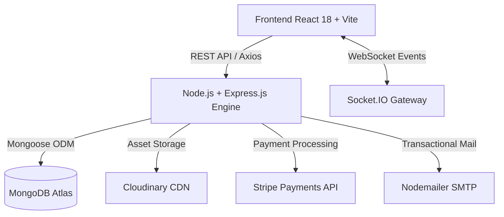

<div align="center">

# 🧵 AUTO STITCH
### *Next-Gen Bespoke Tailoring, Multi-Vendor Marketplace & Couture Platform*

[](https://reactjs.org/)
[](https://vitejs.dev/)
[](https://nodejs.org/)
[](https://expressjs.com/)
[](https://www.mongodb.com/)
[](https://socket.io/)
[](https://stripe.com/)
[](LICENSE)

<br />

**Auto Stitch** is an end-to-end multi-vendor custom tailoring e-commerce ecosystem. It unites customers seeking artisanal bespoke clothing with premier boutique ateliers through a real-time custom bidding engine, live order progression tracking, promo code validation, instant stock reconciliation, KYC compliance verification, and direct atelier messaging.

[Explore Platform](#-features--architecture) • [Demo Walkthrough](#-demo-accounts--roles) • [Getting Started](#-installation--local-setup) • [API Reference](#-api-endpoints)

---

</div>

## 🌟 Standout Capabilities & Architecture

### 1. 🛍️ Luxury Multi-Vendor Atelier Marketplace
* **Customer Journey**: Curated collections, instant search with suggestions, custom fabric and sizing selectors, wishlist synchronization, and persistent cart drawer.
* **Boutique Command Center**: Atelier owners manage catalogues, update real-time stock levels, accept/reject custom tailoring requests, track order pipeline stages, and initiate earnings payouts.
* **Administrator Oversight**: Platform moderation suite for boutique KYC verification, listing moderation, financial escrow tracking, user management, and dispute mediation.

### 2. ⚡ Real-Time Bespoke Bidding Engine
* Customers submit custom design inquiries with reference photos, target measurements, and deadline preferences.
* Registered boutique ateliers submit competitive proposals and cost estimations.
* Customers compare quotes, message ateliers directly via **Socket.IO**, and accept proposals to trigger automated order generation.

### 3. 📍 Live Visual Order Tracking (`/track`)
* On-screen 6-stage interactive stepper:
  $$\text{Order Placed} \rightarrow \text{Accepted} \rightarrow \text{In Tailoring} \rightarrow \text{Quality Passed} \rightarrow \text{Dispatched} \rightarrow \text{Delivered}$$
* Tracks courier AWB numbers, item breakdowns, atelier origin, and estimated transit times using a 6-character Reference ID (e.g. `#AS-5A2B9C`).

### 4. 🎟️ Intelligent Coupon & Promo Engine
* Dynamic promo validator supporting percentage discounts, flat fee reductions, minimum cart thresholds, and complimentary express shipping.
* Ready-to-demo promo codes:
  * `EID20` — 20% off total basket
  * `AUTOSTITCH10` — 10% welcome discount
  * `FLAT500` — PKR 500 off (orders > PKR 3,000)
  * `FREESHIP` — Free nationwide express shipping

### 5. 📦 Live Stock Deduction & Inventory Tracking
* Automatic atomic decrementing of `product.stock` (`-quantity`) and incrementing of `product.soldCount` (`+quantity`) on every order checkout.
* Boutique inventory dashboards reflect remaining stock in real time without stale caches.

### 6. 🛡️ Boutique KYC Compliance & Verification
* Boutique onboarding flow requiring National CNIC numbers and business trade certificates.
* Live status badges (*Verified Partner / Pending Review / Rejected*) with administrative approval workflows.

### 7. 💬 Direct Atelier Messaging & Live Chimes
* Real-time WebSocket communication via **Socket.IO**.
* Direct price quotation dispatching inside conversation threads with one-click customer acceptance.
* Real-time typing indicators, read receipts, and luxury audio feedback chimes.

### 8. 📱 100% Fluid Responsive Engineering
* Masterclass responsive architecture supporting viewports from **320px ultra-compact phones** to **4K / Ultrawide monitors**.
* Incorporates CSS `clamp()` fluid typography, touch-first drawer navigations, table containment shields, and iOS notch safe-area insets (`env(safe-area-inset)`).

---

## 🛠️ Tech Stack & Engineering



| Layer | Technologies |
| :--- | :--- |
| **Frontend UI** | React 18, Vite, React Router DOM, Lucide Icons, React Hot Toast |
| **Styling & Aesthetics** | Pure Vanilla CSS Design System, Tenor Sans / Playfair Display / Poppins Typography, Glassmorphism |
| **Backend API** | Node.js (v20+), Express.js, Express Validator, Helmet, CORS |
| **Real-Time Gateway** | Socket.IO |
| **Database** | MongoDB Atlas, Mongoose ODM |
| **Authentication & Security** | JWT (Access + Refresh Tokens), Bcrypt.js, Google OAuth 2.0, 2FA TOTP |
| **External Integrations** | Stripe, Cloudinary, Groq LLM, HuggingFace, Nodemailer |

---

## 📂 Project Directory Structure

```
Auto-Stitch/
├── backend/
│   ├── config/             # Database connection & Stripe configuration
│   ├── controllers/        # Order, Auth, Boutique, Product, Coupon controllers
│   ├── middleware/         # JWT Auth, Role Authorization, Security headers
│   ├── models/             # Mongoose Schemas (User, Product, Order, Boutique, Coupon)
│   ├── routes/             # REST API Endpoints
│   ├── utils/              # Email templates, Socket handlers, Cron tasks
│   ├── .env.example        # Environment variable template
│   └── server.js           # Express app & WebSocket server entry point
│
├── frontend/
│   ├── public/             # High-res photography, brand videos, icons
│   ├── src/
│   │   ├── assets/         # Slider banners, logo assets
│   │   ├── components/     # Navbar, Footer, CartDrawer, Chatbot, ProductCard
│   │   ├── config/         # API endpoints & client constants
│   │   ├── context/        # CartContext, WishlistContext
│   │   ├── pages/          # Home, Catalogue, ProductDetail, Cart, Checkout,
│   │   │                   # AdminDashboard, BoutiqueManage, Chat, Bids, Profile
│   │   ├── utils/          # Audio chimes, Socket client, Auth helpers
│   │   ├── App.jsx         # Client routing table & navigation guards
│   │   ├── index.css       # Core design system tokens & fluid responsive engine
│   │   └── main.jsx        # React application bootstrap
│   └── .env.example        # Client environment template
│
└── README.md
```

---

## 🔑 Demo Accounts & Roles

| Role | Access Route | Sample Credentials / Features |
| :--- | :--- | :--- |
| **Customer** | `/login` | Browse collections, add to bag, apply coupons, submit bids, track orders |
| **Boutique Owner** | `/boutique/login` | Inventory management, order fulfillment, quote submission, KYC compliance |
| **Administrator** | `/admin/login` | Platform analytics, boutique KYC approvals, payout disbursements, ticket moderation |

---

## 🚀 Installation & Local Setup

### Prerequisites
* [Node.js](https://nodejs.org/) (v18 or higher recommended)
* [MongoDB](https://www.mongodb.com/) (Local instance or MongoDB Atlas cluster URI)
* [Git](https://git-scm.com/)

### 1. Clone the Repository
```bash
git clone https://github.com/Ramisali007/Auto-Stitch.git
cd Auto-Stitch
```

### 2. Configure Backend Environment
Navigate into `backend/`, duplicate `.env.example` as `.env`, and populate your credentials:
```bash
cd backend
cp .env.example .env
```
```env
PORT=5000
NODE_ENV=development
CLIENT_URL=http://localhost:5173
MONGO_URI=mongodb+srv://<username>:<password>@cluster.mongodb.net/autostitch?retryWrites=true&w=majority
JWT_SECRET=your_secure_jwt_secret_key
STRIPE_SECRET_KEY=sk_test_your_stripe_key
CLOUDINARY_CLOUD_NAME=your_cloud_name
CLOUDINARY_API_KEY=your_api_key
CLOUDINARY_API_SECRET=your_api_secret
EMAIL_USER=your_email@gmail.com
EMAIL_PASS=your_app_password
```

### 3. Configure Frontend Environment
Navigate into `frontend/`, duplicate `.env.example` as `.env`:
```bash
cd ../frontend
cp .env.example .env
```
```env
VITE_API_URL=http://localhost:5000
```

### 4. Install Dependencies & Start Applications

**Start Backend Server:**
```bash
cd backend
npm install
npm run dev
# Server listening on http://localhost:5000
```

**Start Frontend Application:**
```bash
cd frontend
npm install
npm run dev
# Application accessible at http://localhost:5173
```

---

## 🌐 API Endpoints Reference

### 🔐 Authentication & Profile (`/api/auth`)
* `POST /api/auth/register` — Register customer or boutique owner
* `POST /api/auth/login` — Sign in and receive JWT authentication tokens
* `GET /api/auth/me` — Retrieve current authenticated session
* `PUT /api/auth/profile` — Update address & notification preferences
* `POST /api/auth/2fa/setup` — Initialize TOTP two-factor authentication

### 🛒 Products & Catalogue (`/api/products`)
* `GET /api/products` — Retrieve products with filters, sorting & pagination
* `GET /api/products/:id` — Retrieve product details & bespoke specifications
* `POST /api/products` — Create boutique product listing (*Boutique only*)
* `PUT /api/products/:id` — Update listing details & stock (*Boutique only*)

### 📦 Orders & Tracking (`/api/orders`)
* `POST /api/orders` — Create order, apply coupons & decrement stock
* `POST /api/orders/track` — On-screen live order tracking by 6-char Reference ID
* `GET /api/orders/my-orders` — Customer order history & item status
* `PATCH /api/orders/:id/status` — Progress order through tailoring stages (*Boutique/Admin*)

### 🎟️ Coupons & Discounts (`/api/coupons`)
* `POST /api/coupons/validate` — Validate promo code and compute real-time discount

### 🏪 Boutiques & Compliance (`/api/boutiques`)
* `GET /api/boutiques` — Public directory of approved atelier partners
* `GET /api/boutiques/me` — Current boutique profile & KYC verification status
* `PUT /api/boutiques/kyc` — Submit CNIC & business documents for Admin approval

---

## 🛡️ Security & Hardening Protocols
* **Zero Secret Leakage**: Strict `.gitignore` policy separating secrets from repository code.
* **XSS & Injection Protection**: Parameterized Mongoose queries, input validation, and secure sanitization.
* **Rate Limiting & CORS**: Request throttling on sensitive authentication routes with origin whitelisting.
* **Data Privacy**: Password hashing using 10 salt rounds with Bcrypt.js; optional 2FA TOTP protection.

---

## 📄 License & Attribution
Developed with ❤️ as a **Final Year Project (FYP)**. Released under the [MIT License](LICENSE).
For inquiries or evaluations, please connect via [GitHub](https://github.com/Ramisali007).
