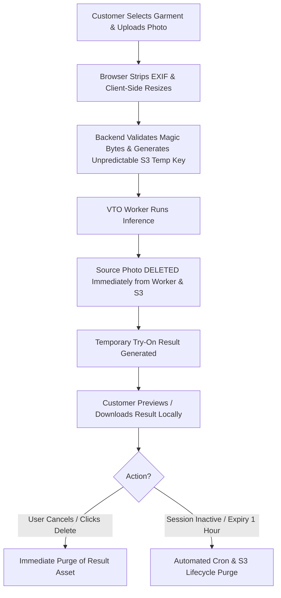

# Virtual Try-On Privacy Architecture & Data Retention Policy

## 1. Executive Summary

The Auto Stitch Virtual Try-On subsystem is built upon a **Privacy-by-Design** foundation. Customer photographs are treated as strictly confidential biometric assets.

---

## 2. Customer Photo Lifecycle

---

## 3. Privacy Guarantees

1. **Zero Customer Training Retention**: Customer imagery is strictly prohibited from entering training datasets, fine-tuning queues, or persistent archives.
2. **Immediate Source Deletion**: The customer's original uploaded portrait is permanently deleted as soon as inference completes.
3. **No Meaningful File/Object Keys**: Object paths use cryptographically random UUIDs:
   - `vto/temp/{jobId}/person/{uuid}.webp`
   - `vto/temp/{jobId}/result/{uuid}.webp`
4. **EXIF Stripping**: All GPS location tags, camera make/models, timestamps, and device fingerprints are stripped before processing.
5. **Private Storage Only**: Direct public S3 bucket access is blocked; all temporary asset access requires short-lived (max 15-minute) pre-signed URLs.
6. **No Image Data in Logs**: Server, worker, and container logs strictly forbid base64 strings, binary payloads, or customer identifying filenames.
